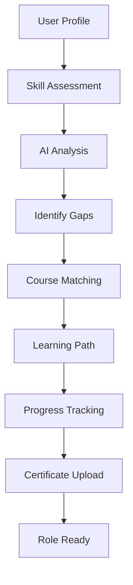

# Skill Gap Analysis & AI Learning Recommendation System

## 📋 Overview

A comprehensive AI-powered skill gap analysis platform that identifies missing skills for target job roles and provides personalized course recommendations from platforms like Udemy, Coursera, and YouTube.


## 🚀 Key Features

### 🔍 Skill Gap Analysis
- **AI-Powered Analysis**: Identifies skill gaps between current and target job roles
- **Real-time Matching**: Calculates match percentage with target positions
- **Priority Classification**: Categorizes skills as High/Medium/Low priority based on importance scores
- **Multi-dimensional Assessment**: Evaluates technical, soft, and domain-specific skills

### 🎓 Smart Course Recommendations
- **Platform Integration**: Pulls real courses from Udemy, Coursera, and YouTube
- **Skill-Based Filtering**: Matches courses to specific missing skills
- **AI-Powered Relevance**: Uses machine learning to recommend most relevant content
- **Multi-platform Support**: 
  - Udemy (Web Development, Design, Business, Music courses)
  - Coursera (University-level courses)
  - YouTube (Free tutorials)

### 📚 Learning Path Management
- **Personalized Learning Pathways**: AI-generated step-by-step learning journeys
- **Progress Tracking**: Real-time progress monitoring with visual indicators
- **Status Management**: Track course progress (Not Started → Started → Completed)
- **Certificate Upload**: Upload completion certificates to validate progress

### 🎯 Career Transition Support
- **Role Comparison**: Clear display of current vs. target job roles
- **Transition Insights**: AI-generated insights for career switching
- **Time Estimation**: Predicts time required to close skill gaps
- **Salary Impact**: Shows potential salary improvements

## 🏗️ System Architecture

```
Frontend (React) ←→ Backend (Spring Boot) ←→ AI Service (Python FastAPI)
       ↓               ↓                       ↓
   User Interface  Business Logic         ML Recommendations
   Progress Tracking Data Persistence     Course Matching
   Course Display  User Management        Skill Analysis
```

## 🛠️ Technology Stack

### Frontend
- **React 18** with TypeScript
- **Framer Motion** for animations
- **Tailwind CSS** for styling
- **React Hot Toast** for notifications
- **Lucide React** for icons

### Backend
- **Java Spring Boot** REST API
- **MongoDB** for data storage
- **Lombok** for boilerplate reduction
- **REST Template** for external API calls

### AI/ML Service
- **Python FastAPI** for ML endpoints
- **Pandas** for data processing
- **Custom recommendation algorithms**
- **Dataset integration** (Coursera, Udemy, job roles)

## 📊 Data Sources

| Dataset | Records | Description |
|---------|---------|-------------|
| `Coursera.csv` | 3,000+ | University and professional courses |
| `Udemy Web Development` | 3,000+ | Web development courses |
| `Udemy Design Courses` | 1,000+ | Design and creative skills |
| `Udemy Business Courses` | 1,000+ | Business and management |
| `Udemy Music Courses` | 500+ | Music and audio production |
| `IT_Job_Roles_Skills.csv` | 50+ | IT job roles with required skills |

## 🔄 Workflow



## 🎨 UI/UX Features

### Visual Design
- **Dark/Light Mode** support
- **Animated Progress Bars** with real-time updates
- **Interactive Course Cards** with hover effects
- **Responsive Design** for all devices
- **Professional Gradient** color schemes

### User Experience
- **Smart Filters**: Platform, duration, rating, difficulty
- **Search Functionality**: Find courses by name or platform
- **Status Indicators**: Visual course progress tracking
- **One-click Redirects**: Direct access to course platforms
- **Save for Later**: Bookmark interesting courses

## 🚀 Quick Start

### Prerequisites
- Node.js 16+
- Java 11+
- Python 3.8+
- MongoDB

### Installation Steps

1. **Clone Repository**
   ```bash
   git clone https://github.com/your-org/skill-gap-analysis.git
   cd skill-gap-analysis
   ```

2. **Backend Setup**
   ```bash
   cd backend
   ./mvnw spring-boot:run
   # Runs on http://localhost:2090
   ```

3. **AI Service Setup**
   ```bash
   cd ai-service
   pip install -r requirements.txt
   python enhanced_skill_gap_with_course_recommendations.py
   # Runs on http://localhost:8000
   ```

4. **Frontend Setup**
   ```bash
   cd frontend
   npm install
   npm run dev
   # Runs on http://localhost:3000
   ```

5. **Data Import**
   - Place all CSV files in `ai-service/data/` directory
   - Ensure file names match expected patterns

### Environment Configuration

**Backend (.env)**
```properties
SPRING_DATA_MONGODB_URI=mongodb://localhost:27017/skillgap
PYTHON_ML_SERVICE_URL=http://localhost:8000
JWT_SECRET=your-secret-key
```

**AI Service**
```python
# Update dataset paths in enhanced_skill_gap_with_course_recommendations.py
DATASET_PATH = "./data/"
```

## 🔧 API Endpoints

### Backend Endpoints
| Method | Endpoint | Description |
|--------|----------|-------------|
| `GET` | `/api/recommendations/user/{userId}` | Get user recommendations |
| `POST` | `/api/recommendations/save-enrollment` | Save course enrollment |
| `POST` | `/api/recommendations/save-course` | Save course for later |

### AI Service Endpoints
| Method | Endpoint | Description |
|--------|----------|-------------|
| `POST` | `/api/recommendations/generate` | Generate AI recommendations |
| `POST` | `/internal-analyze` | Skill gap analysis |
| `GET` | `/api/job-roles` | Get available job roles |

## 🎯 Use Cases

### For Job Seekers
- Identify skills needed for career advancement
- Find relevant courses to fill skill gaps
- Track learning progress systematically

### For Career Switchers
- Understand requirements for new roles
- Get personalized learning pathways
- Smooth transition between industries

### For Organizations
- Employee skill development tracking
- Training program recommendations
- Talent gap analysis

## 💡 AI-Powered Insights

The system provides intelligent insights like:
- "Focus on Python and SQL - these are core for Data Scientist roles"
- "You can become job-ready in 2-3 months with focused learning"
- "Complete foundational skills first, then advanced technologies"
- "Cloud skills can increase your market value by 30%"

## 🐛 Known Issues & Solutions

### Fixed Issues
- **450% Progress Bug**: Resolved with proper progress calculation
- **Course Status Management**: Implemented proper state transitions
- **Job Role Display**: Added current and target role visualization

### Current Limitations
- Limited to IT job roles (expandable)
- Course data requires periodic updates
- Certificate validation is manual

## 🔮 Future Enhancements

- [ X ] **Skill Assessment Tests**: Validate skill proficiency
- [ ] **Peer Learning**: Connect with others learning same skills
- [ ] **Job Market Integration**: Real-time job requirement updates
- [ ] **Mobile App**: Learn on-the-go with mobile application
- [ ] **Corporate Dashboard**: Team skill management for organizations
- [ ] **AI Chat Assistant**: Personalized learning guidance

## 🤝 Contributing

1. Fork the repository
2. Create a feature branch (`git checkout -b feature/amazing-feature`)
3. Commit your changes (`git commit -m 'Add amazing feature'`)
4. Push to the branch (`git push origin feature/amazing-feature`)
5. Open a Pull Request

## 📄 License

This project is licensed under the MIT License - see the [LICENSE.md](LICENSE.md) file for details.

## 🆘 Support

For support and questions:
- 📧 Email: medamkowsik2004@gmail.com
- 🐛 Issues: [GitHub Issues](https://github.com/your-org/skill-gap-analysis/issues)

## 🙏 Acknowledgments

- Course data provided by Coursera and Udemy
- Job role data from industry standards
- Icons by Lucide React
- Animation by Framer Motion

---

**Built with ❤️ using React, Spring Boot, and Python AI**
``
<div align="center">

### 🎯 Start your learning journey today!

[](http://localhost:3000)

</div>
```
